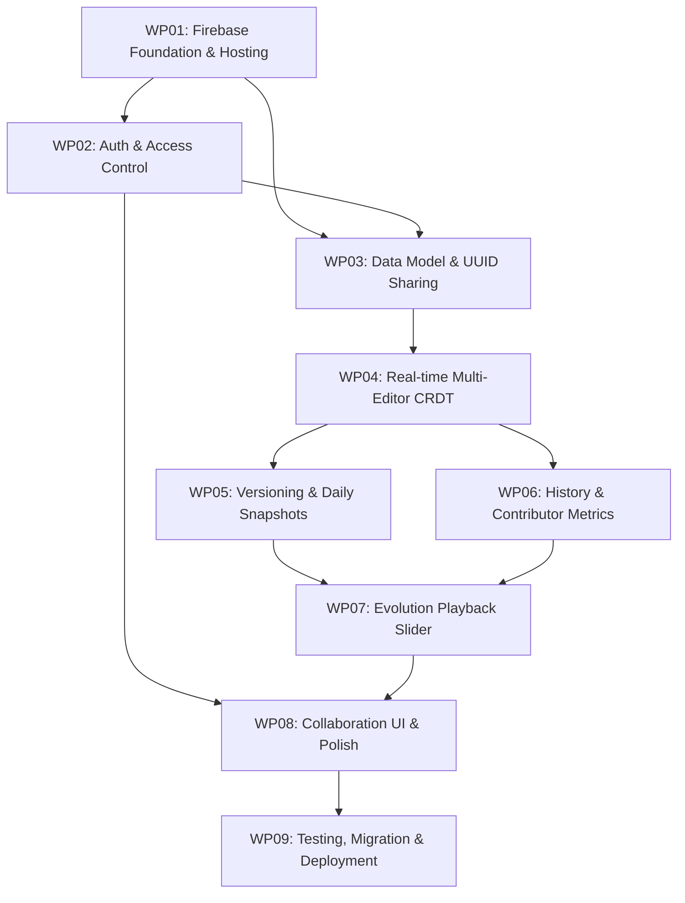

# MMC to Firebase Platform — Work Packages Roadmap

This directory contains the modular Work Packages (WPs) defining the transition of the Mission Model Canvas (MMC) from a single-user local-storage tool to a real-time, multi-editor collaborative web service hosted on Firebase.

---

## Architecture Blueprint

```
                      +---------------------------------------+
                      |       MMC Web Client (SPA)            |
                      | - Vanilla HTML5/CSS Grid / Modern JS  |
                      | - Yjs Collaborative CRDT Engine       |
                      | - UI: Playback Slider, Presence, Diffs|
                      +-------------------+-------------------+
                                          |
               +--------------------------+--------------------------+
               |                          |                          |
    +----------v----------+    +----------v----------+    +----------v----------+
    |   Firebase Auth     |    |   Cloud Firestore   |    | Firebase Realtime DB|
    | - Google Sign-in    |    | - Canvas Metadata   |    | - Low-latency CRDT  |
    | - Email Auth        |    | - Access Roles      |    |   updates (Yjs)     |
    | - Anonymous Guests  |    | - Versions/Snapshots|    | - Presence & Focus  |
    |                     |    | - Contributor Stats |    |   awareness         |
    +---------------------+    +----------+----------+    +---------------------+
                                          |
                               +----------v----------+
                               |   Cloud Functions   |
                               | - Scheduled Daily   |
                               |   Snapshots (Cron)  |
                               | - Token generation  |
                               | - Email invites     |
                               +---------------------+
```

---

## Work Package Index & Status

| Work Package | Title | Target Scope | Prerequisites | Status |
| :--- | :--- | :--- | :--- | :--- |
| **[WP01](./WP01-firebase-foundation-hosting.md)** | Firebase Foundation & Hosting | Firebase CLI, project config, emulator suite, deployment workflow | None | In progress — emulator suite (auth/firestore/rtdb/functions) running locally; project id `mission`; not yet deployed to hosting |
| **[WP02](./WP02-auth-access-control.md)** | Auth & Access Control | Anonymous guest auth, Google/Email sign-in, user profiles, security rules | WP01 | In progress — anonymous + Google sign-in wired end-to-end, role gating (viewer/editor/owner) enforced in UI and Firestore rules; Email auth not started |
| **[WP03](./WP03-data-model-and-sharing.md)** | Data Model, UUID Sharing & Invites | Firestore schema, UUID read-only link, collaborator invite system | WP01, WP02 | In progress — canvas CRUD, invite create/redeem (via Cloud Function) verified against emulator; collaborator list UI done; email delivery still console-log only |
| **[WP04](./WP04-realtime-collaboration.md)** | Concurrent Editing & Presence | CRDT (Yjs) sync in each field, remote cursors, active field focus glow | WP01, WP03 | In progress — Yjs `Y.Text` per field relayed via Realtime DB, awareness-based presence avatars and focus-color glow wired into UI; convergence verified via offline two-doc merge test; disconnect/reconnect and RTDB update-log growth (no compaction) not yet addressed |
| **[WP05](./WP05-versioning-and-daily-snapshots.md)** | Versioning & Automated Snapshots | Named waypoints, scheduled daily snapshot Cloud Function, snapshot load | WP03, WP04 | Stub — module and Cloud Function scaffolded, not deepened or tested |
| **[WP06](./WP06-history-and-metrics.md)** | Contributor History & Metrics | Edit tracking, contribution % per user, per-block metrics UI | WP04, WP05 | Stub — metrics toggle wired to UI, underlying contribution tracking not implemented |
| **[WP07](./WP07-evolution-playback-ui.md)** | Evolution Playback & Day Slider | Scrubbable slider, day-by-day evolution, waypoint jumps, diff highlights | WP05, WP06 | Stub — diff-highlight toggle wired to UI, scrubber/playback logic not implemented |
| **[WP08](./WP08-ui-modernization-and-polish.md)** | Collaboration UI & Header Polish | Top toolbar, presence avatars, modals (share, versions, metrics), dark mode | WP02 - WP07 | In progress — collab toolbar, sign-in button/user badge, share/collaborator UI, and presence avatars done; Waypoint/Metrics modals still stubs; dark mode/print audit of new elements and mobile viewport check not started |
| **[WP09](./WP09-testing-migration-verification.md)** | Testing, Migration & Deployment | LocalStorage migration, Firestore security rules tests, load verification | WP01 - WP08 | In progress — 12/12 tests passing (unit roles + Firestore rules) against emulator; localStorage migration banner stubbed; load/deployment verification not started |
| **[WP10](./WP10-ux-accessibility-audit.md)** | UX, Usability & Accessibility Remediation | Heuristic UX review + WCAG 2.2 AA audit of login gate, menu, modals, playback sidebar, editable canvas | WP08 | Not started — audit complete (4 critical, 5 serious, 5 moderate, 3 minor findings), fixes not yet applied |

---

## Implementation Dependency Graph



---

## Design Invariants to Maintain Across All Packages
1. **Zero UI Bloat**: Preserve the clean, focused feel of the Portsmouth Mission Model Canvas.
2. **Pedagogical Alignment**: URL fragment hashing (`#kp-ka-vp`) must continue functioning for presentations.
3. **Graceful Fallback**: The canvas must cleanly handle disconnected or offline scenarios without crashing.
4. **Accessible & Responsive**: Contrast ratios, ARIA semantics, mobile layout (`width < 40em`), and `@media print` must not be degraded.

---

## Progress Log

- Scaffolded all 9 WPs end-to-end at stub depth (config, module shells, Cloud Functions, security rules, tests) — legacy local-only canvas left untouched and fully functional as fallback.
- Firebase project identity set to `mission` (staging: `mission-staging`); local Emulator Suite (Auth :9099, Firestore :8180, Realtime DB :9000, Functions :5001) running and used for all verification below.
- **Auth**: anonymous sign-in + Google account linking wired into toolbar (sign-in button / user badge); role-based gating (viewer read-only, share hidden from non-owners) enforced in UI and mirrored in `firestore.rules`.
- **Invites**: `redeemInvite` moved from a dead client-side stub (unreachable under security rules) to a Cloud Function (`functions/invites.js`), called via `httpsCallable`; `/invite/:canvasId/:inviteToken` route added; collaborator list renders active + pending invites. Invite delivery is console-log only — no email provider configured.
- Previously dead UI toggles (`playback-diff-toggle`, `metrics-highlight-toggle`) now wired to their (still-stub) underlying features.
- **Realtime collaboration (WP04)**: `js/collab.js` binds a `Y.Text` CRDT per field via a `FirebaseYjsProvider` relaying updates through Realtime DB (`push`/`onValue`); awareness/presence renders as focus-color glow + avatar pills in `app.js`. CRDT merge convergence verified with an offline two-doc simulation (concurrent inserts from both peers converge to the same text). Known gaps: caret handling is a simple clamp (not a real diff/patch), the RTDB update log is never compacted (unbounded growth), and disconnect/reconnect recovery is untested.
- **Testing**: 12/12 tests passing (5 unit role tests, 7 Firestore rules tests) against the live emulator; all JS modules pass `node --check`.
- **Not yet started/deepened**: snapshot/versioning logic (WP05), contributor metrics tracking (WP06), playback scrubber (WP07), Waypoint/Metrics modals + dark mode/print/mobile audit (WP08), localStorage migration flow and real deployment verification (WP09).
